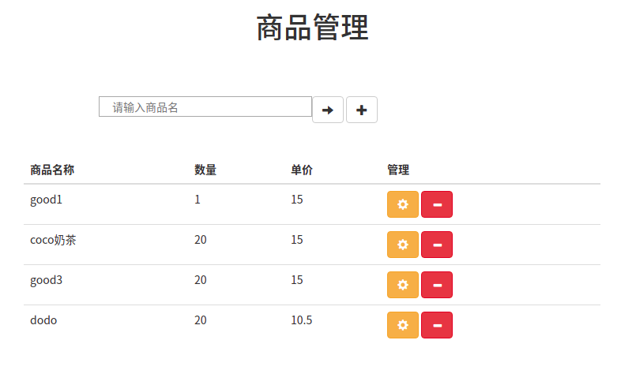
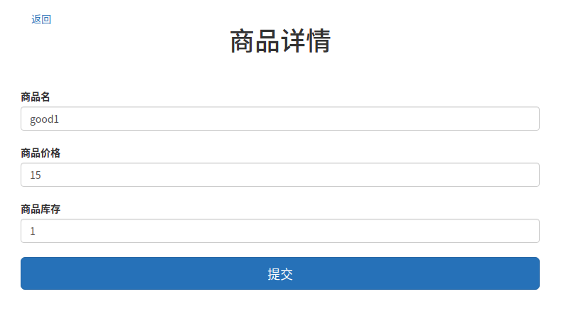
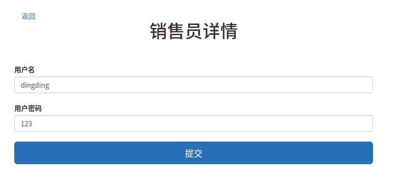
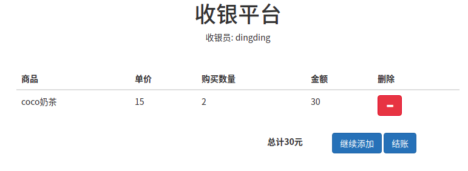
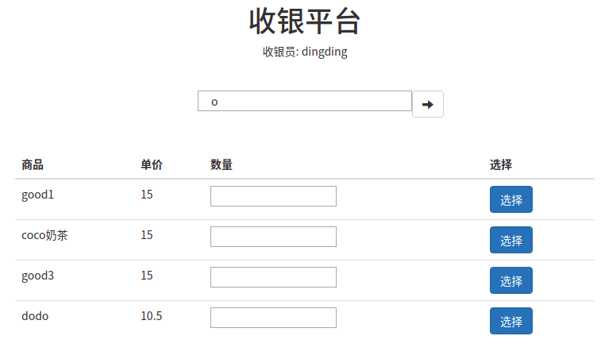

# Java SMS 练习项目系列 超市管理系统

## 项目背景
商超购物管理系统具有商品管理、前台收银、商品库存等功能，本项目使用java作为开发语言，mySQL数据库存储数据，可以有效地锻炼和加强学生运用java、mySQL数据库及基本sql编程开发的能力。
本项目适用于有java、基本sql基础的学生进行实战训练。

## 页面展示

商品管理


商品详情


销售员管理


销售员详情


结账页面


添加结账商品

## 项目版本演进及以往版本
该项目系列从最初的Java SE的控制台版本到当前的版本, 在不断整合JavaEE知识点进行演进和重构.
往期版本可以通过切换tag进行查看, 目前包括的项目版本:
- JavaSE+JDBC
- Servlet+JDBC
- Spring+Servlet+JDBCTemplate
- SpringMVC + Spring + Mybatis

## 当前版本说明
使用经典的SSM架构对超市管理系统进行重构.

数据库: mySQL-5.7

默认容器: tomcat-9.0.31

主要依赖: Mybatis, Spring, SpringMVC, freeMarker,

数据库构建文件: `src/main/resources/shema.sql`

编译和启动方式
```shell
mvn package
```

输出war包位于target/myShoppingManagement-xxx.war


当前版本相关技术知识点:
- mybatis的注解开发
- spring的事务管理
- spring应用单元测试
- springMVC的注解开发